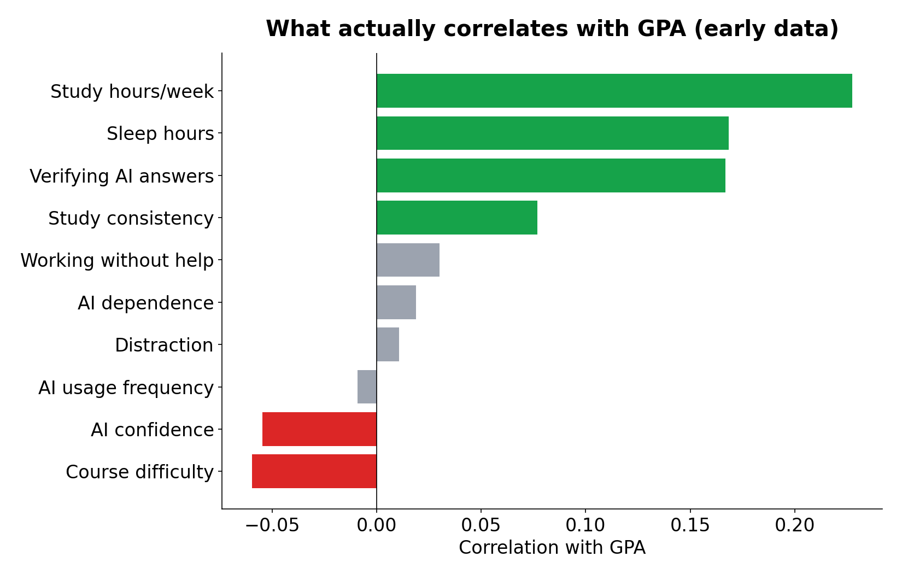

# Quantifying the Impact of AI-Assisted Learning on Student Performance
An end-to-end machine learning study examining how students' AI usage patterns (ChatGPT and similar tools) relate to academic performance.
**Author:** [Mazen Fraihat](https://mazenfraihat.com) · CS Senior @ Cal Poly Pomona
**Status:** 🟡 In progress — modeling & interpretation phase
## Why this project
AI is changing how students learn, but education systems are not adapting at the same pace. Students already use AI daily for studying, assignments, coding, and writing — some effectively, others in ways that may hurt real learning. There is still little practical, data-driven guidance on how to use AI without harming your education.
This project aims to answer:
- How does AI usage relate to academic performance (GPA)?
- Which types of AI use are associated with better outcomes?
- Can we predict performance from study habits and AI behavior?
## Method
| Phase | Description | Status |
|---|---|---|
| 1. Collect | Anonymous global survey of students — GPA, study habits, AI usage patterns, sleep, and more | ✅ Primary collection complete — survey remains open |
| 2. Clean | Validate responses, drop failed attention checks, normalize formats | ✅ Complete |
| 3. Explore | Correlations, distributions, and patterns across AI-usage groups | ✅ Complete — see `figures/` |
| 4. Model | Linear regression, random forest, and XGBoost to predict GPA from behavior | 🟡 In progress - Testing |
| 5. Interpret | Publish findings + practical advice via video series (English & Arabic) | 🟡 In progress |
## Early findings (patterns, not proof)
1. **How much students use AI shows ~zero correlation with GPA.** Usage frequency doesn't predict performance either way — *how* you use it matters, not how often.
2. **Students who never verify AI answers have the lowest average GPA** in the sample (3.16 vs ~3.5 for everyone else).
3. **Fundamentals still lead:** weekly study hours and sleep show the strongest positive correlations with GPA.

Full charts in `figures/`, full pipeline in `notebooks/`. Predictive modeling continues as the sample grows.
## Survey design
~2-minute anonymous survey covering six areas: academic performance, study behavior, AI usage (frequency, purpose, dependence, verification habits), academic context, and extra factors (sleep, distraction). Includes an attention-check question for response quality.
📋 **[Take the survey](https://docs.google.com/forms/d/e/1FAIpQLSeb0pomB0vYPhyEJrLJtosmPld5pqtleHcDf82_1QVSBm0KTg/viewform)** — every response improves the analysis.
## Repo structure
